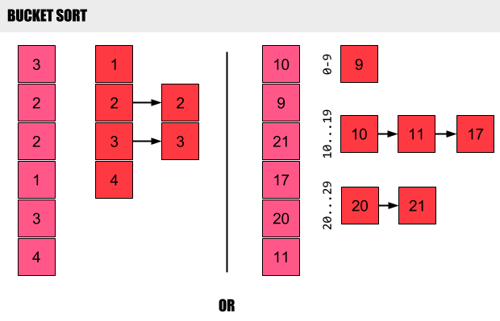

## Chapter 1

A **data structure** is a way to store and organize data in order to facilitate access and modifications.

## Chapter 2

### Insertion sort

- It is efficient algorithm for sorting a small number of elements.

- The algorithm sorts the input numbers **in place**: it rearranges the numbers within the
array ```A```, with at most a constant number of them stored outside the array at any
time. The input array A contains the sorted output sequence when the INSERTION SORT
procedure is finished.

- It is **stable**

**Stable** sorts maintain the order of items that are deemed equal, whereas **unstable** sorts
make no such guarantees. In other words will not exchange equal values. An unstable sort
(of which the most famous sort, quicksort, is an example) wouldn't guarantee anything
about the order of the equals, just that the smaller appear before.

**Normally, the property of stability is important only when satellite data are carried
around with the element being sorted.**

- The best case occurs if the array is already sorted.

- Running time is ```theta of n-squared```

### Loop invariants

**Initialization:** It is true prior to the first iteration of the loop.

**Maintenance:** If it is true before an iteration of the loop, it remains true before the
                 next iteration.

**Termination:** When the loop terminates, the invariant gives us a useful property
                 that helps show that the algorithm is correct.

### Merge sort

- Uses divide and conquer to recursively divide and sort the list


- Time Complexity: O(n log n)
- Space Complexity: O(n)
- Stable: Yes

## Chapter 4:

### Divide and conquer technique

**Divide** the problem into a number of subproblems that are smaller instances of the
           same problem.

**Conquer** the subproblems by solving them recursively. If the subproblem sizes are
           small enough, however, just solve the subproblems in a straightforward manner.

**Combine** the solutions to the subproblems into the solution for the original problem.

When the subproblems are large enough to solve recursively, we call that the **recursive**
**case**. Once the subproblems become small enough that we no longer recurse, we say that the
recursion "bottoms out" and that we have gotten down to the **base case**. Sometimes, in
addition to subproblems that are smaller instances of the same problem, we have to solve
subproblems that are _not quite the same as the original problem_. We consider solving such
subproblems as part of the combine step.

### Master theorem

The master method provides a "cookbook" method for solving recurrences of the form:

```
T(n) = a.T(n/b) + f(n)
```

The recurrence describes the running time of an algorithm that divides a problem of size
```n``` into a subproblems, each of size ```n/b```, where ```a``` and ```b``` are positive
constants. The ```a``` subproblems are solved recursively, each in time ```T(n/b)```.  The
function ```f(n)``` encompasses the cost of dividing the problem and combining the results
of the sub-problems.

## Chapter 6

### Heapsort

- _Insertion sort, merge sort, heapsort,_ and _quicksort_ are all **comparison sorts**: they
determine the sorted order of an input array by comparing elements.

- Like merge sort, but unlike insertion sort, heapsort's running time is O(n.lg n). Like
insertion sort, but unlike merge sort, **heapsort sorts in place**: only a constant number of
array elements are stored outside the input array at any time.

- Heapsort also introduces another algorithm design technique: **using a data structure**, in
this case one we call a "heap," to manage information. Not only is the heap data structure
useful for heapsort, but it also makes **an efficient priority queue.**


The **(binary) heap data structure** is _an array object_ that we can view as a nearly
complete **binary tree**. An array ```A``` that represents a heap is an object with two
attributes: ```A.length```, which (as usual) gives the number of elements in the array, and
```A.heap-size```, which represents how many elements in the heap are stored within array ```A```.

If the heap begins at ```L[1]``` then the left child of the node stored in ```L[i]``` is in ```L[2i]``` and
the right child is in ```L[2i + 1]```. Therefore, the parent of the node stored in ```L[j]``` is in
```L[lower_bound(j/2)]```. More generally, we can put the heap anywhere in the array; it does not have to
begin at location one. If it begins at ```L[lower]``` then the appropriate access functions are:

```
PARENT(i) = lower_bound((i + lower - 1) / 2)
LEFT(i)   = 2i - lower + 1
RIGHT(i)  = 2i - lower + 2

```
Note there is no waste of space.

- There are two kinds of binary heaps: **max-heaps** and **min-heaps**(used in priority queues).
In both kinds, the values in the nodes satisfy a **heap property**, the specifics of which
depend on the kind of heap. In a max-heap, the max-heap property is that for every node i
other than the root,

```
A[PARENT(i) >= A[i]
```

that is, the value of a node is at most the value of its parent.

### Disadvantage

Not a stable sort, that is, the order of equal value elements is not preserved.

### Priority queues

A **priority queue** is a data structure for maintaining a set ```S``` of elements, each
with an associated value called a **key**. There are two kind: **max-priority** and
**min-priority** queues.

## Chapter 7

### Quicksort

Heapsort is an excellent algorithm, but a **good** implementation of quicksort
usually beats it in practice.

**Divide:** Partition (rearrange) the array ```A[p..r]``` into two (possibly empty) subarrays
```A[p..q-1]``` and ```A[q+1..r]``` such that each element of ```A[p..q-1]``` is less than or equal to A[q],
which is, in turn, less than or equal to each element of ```A[q+1..r]```. Compute the index ```q``` as
part of this partitioning procedure.

**Conquer:** Sort the two subarrays ```A[p..q-1]``` and ```A[q+1..r]``` by recursive calls to quicksort

**Combine:** Because the subarrays are already sorted, no work is needed to combine them:
the entire array ```A[p..r]``` is now sorted.

- The running time of quicksort depends on whether the partitioning is **balanced** or
**unbalanced**, which in turn depends on which elements are used for partitioning.

### Partitioning

- Worst-case partitioning

The worst-case behavior for quicksort occurs when the partitioning routine produces one
subproblem with ```n-1``` elements and one with ```0``` elements.

- Best-case partitioning

If PARTITION produces two subproblems, each of size no more than ```n/2```, since one is of size
```n/2``` and one of size ```n/2 - 1```. In this case, quicksort runs much faster.

## Chapter 8

**Merge sort** and **heapsort** share an interesting property: _the sorted order they determine_
_is based only on comparisons between the input elements. We call such sorting_
_algorithms comparison sorts_. In a comparison sort, we use only comparisons between
elements to gain order information about an input sequence [a1, a2......aN].

### The decision-tree model

A **decision tree** is a full binary tree that represents the comparisons between elements
that are performed by a particular sorting algorithm operating on an input of a given
size. Control, data movement, and all other aspects of the algorithm are ignored.  The
execution of the sorting algorithm corresponds to tracing a simple path from the root of
the decision tree down to a leaf.

### Counting sort

Counting sort assumes that each of the n input elements is an integer in the range ```0``` to ```k```,
for some integer ```k```. When ```k = O(n)```, the sort runs in ```0(n)``` time.

Counting-sort is very efficient for sorting an array of integers when the length, ```n```,
of the array is not much smaller than the maximum value, ```k - 1```, that appears in the array.
That means that it is not efficient if we have very large numbers.

- Time Complexity: 0(n)
- Space Complexity: 0(n)
- Stable: Yes

### Bucket sort

It is very effective when either the data is evenly distributed over a range, or
we have a hash function that disperses it evenly.

If hashing function is ```hash(i) = i // 10```



Bucket sort can be seen as ```k-way``` merge sort.
